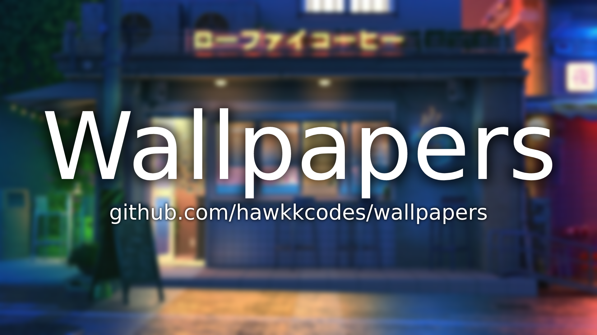

# Wallpapers


This repo contains my personal wallpaper collection, which I'll be expanding whenever I find any new image I like.

The backgrounds are ordered in different folders, depending on the theme they have.

## Where do I find these images?
Most wallpapers from this repo come from various subreddits, such as r/wallpaper or r/unixporn, or image hosting websites like Imgur, for example.

## Resolution and aspect ratio
Every image that can be found in this repo is in 16:9 ratio, and at least 1920x1080. If requested, I can add other aspect ratios, just ask me for it via Twitter (@hawkkcs) direct message.

## Installation and updating
You should be doing fine just by cloning this repo in the directory of your liking, like you would do with any other repo:
```
git clone https://github.com/hawkkcodes/wallpapers
```

In case I update the repo (which is going to be really common, as every week I find new wallpapers), I recommend you to use this command to update the backgrounds:
```
git clone --depth 1 https://github.com/hawkkcodes/wallpapers
```

What "--depth 1" does is that it only clones the last brach of the repo, giving you access to all the images of the most recent version of it, without the need to download all backgrounds again.


## Ownership
In most of the cases I don't have any knowledge if these images have any kind of copyright.

In case you are the author of any of this repo's images, and they have limited use, contact me via Twitter (@hawkkcs) direct message as soon as possible and I'll delete them from the repo with pleasure.

